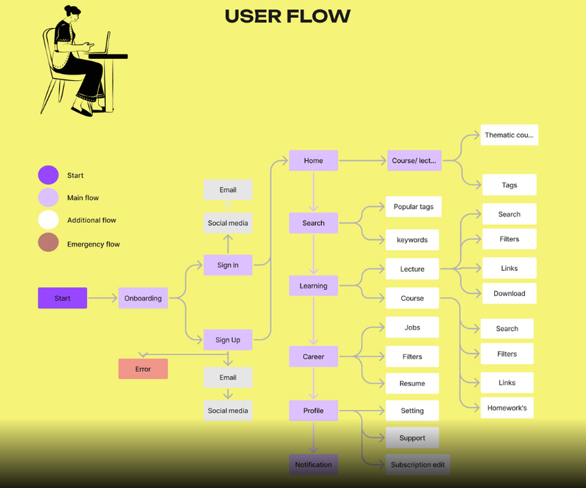

# Automated Hiring Platform

The Automated Hiring Platform is a web-based application aimed at simplifying and automating the recruitment process for both job applicants and recruiters. It leverages machine learning algorithms to match the best candidates for job openings, streamlining the hiring process and improving efficiency.

## Features

### 1. Automatic Resume Parsing
- Automatically extract relevant information from resumes uploaded by job seekers.
- Streamline the application process by eliminating manual data entry.
- Allow applicants to review and rectify any inaccuracies in the extracted information.

### 2. Suggested Applicants List
- Provide recruiters with a curated list of top candidates based on job requirements and eligibility criteria.
- Utilize machine learning algorithms to match applicants with job postings.
- Customizable search filters and preferences for recruiters.

### 3. Secure Data Storage and Handling
- Ensure confidentiality and integrity of sensitive data through robust security measures.
- Implement encryption techniques for data protection both at rest and in transit.
- Adhere to industry standards and regulations (e.g., GDPR, HIPAA) for handling personal data.

### 4. Feedback Mechanism for Applicants
- Offer constructive feedback to applicants on their profiles and applications.
- Provide insights into missing skills and areas for improvement.
- Enable communication channels for applicants to seek clarifications or further guidance.

### 5. User Flow

## Getting Started

To get started with the Automated Hiring Platform, follow these steps:

1. Clone the repository:
   git clone https://github.com/divyank7436/automated-hiring-platform.git

2. Install dependencies:
    cd automated-hiring-platform
    npm install

3. Configure environment variables:

## Contributing

Contributions are welcome! Please follow these guidelines when contributing to the project:
- Fork the repository and create your branch from `main`.
- Make sure your code follows the project's coding style and conventions.
- Open a pull request with a clear title and description of your changes.

### Job-Application

